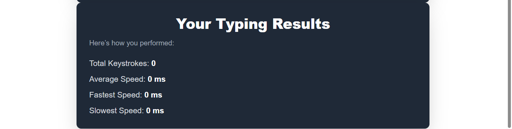
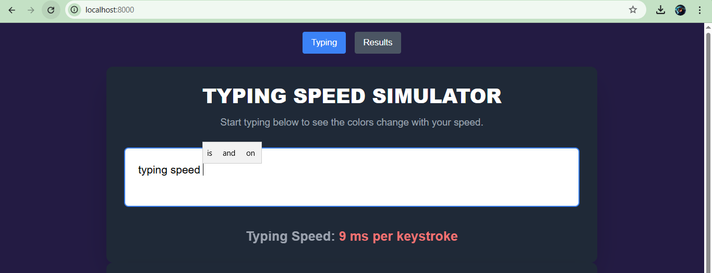
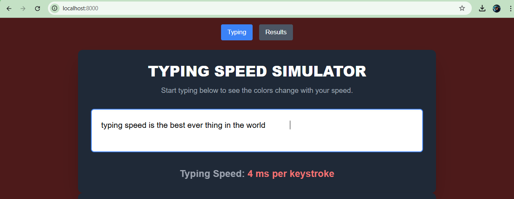

Typing Speed Simulator 🎯

Basic Details

Team Name: Phol-rider

Team Members

Member 1: Savio Vinoj - Viswajyothi College of Engineering, Vazhakulam

Member 2: Jubin Mathew Baiju - Viswajyothi College of Engineering, Vazhakulam

Project Description

Our project is a platform which can change background colour with respect to the typing speed of the user.
It can also compute the  keystrokes of the user.

The Problem (that doesn't exist)

Compute the typing speed of the individual user.

The Solution (that nobody asked for)

Our webpage provides the exact keystrokes of the user,which the user can improve.

For Software:
VS code
HTML,Javascript,CSS

Implementation

For Software:
Run
https://mathew1jubin.github.io/hackton2025/

Project Documentation
For Software:

Team Contributions
[Name 1]: Savio Vinoj
[Name 2]: Jubin Mathew Baiju
